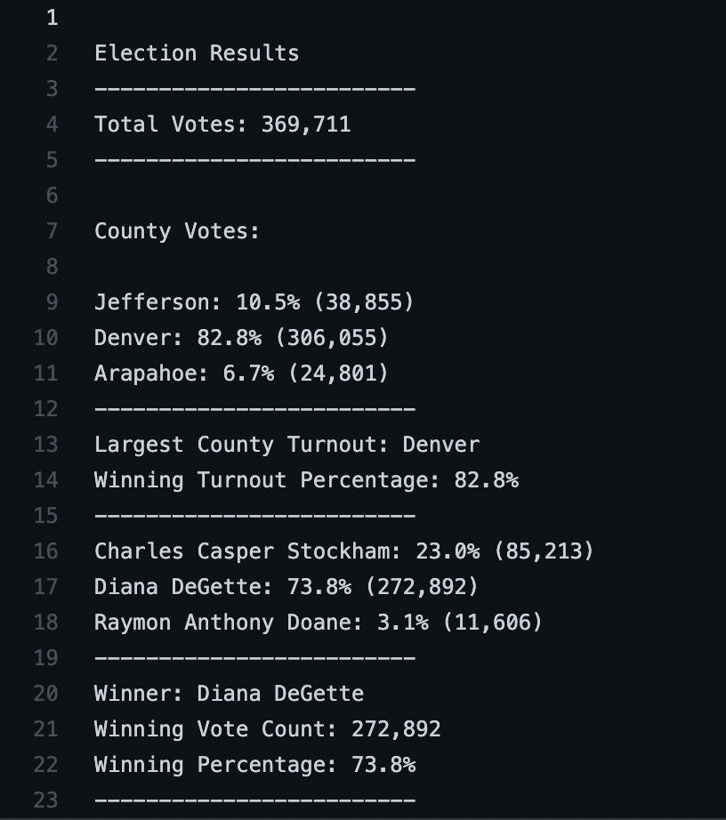
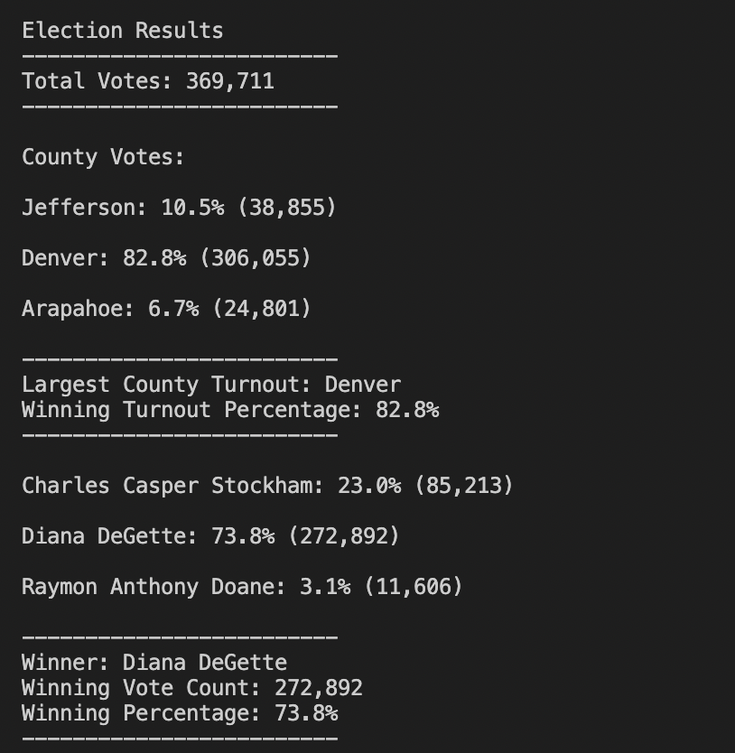

# Election-Analysis

## Project Overview
A Colorado Board of Elections has broguht you an csv with all of the ballot results for the congressional election.
1. Import the file and count the total number of votes cast.
2. Get a complete list of candidates/counties and the amount each candidate/counties recieved.
3. Calculate and print the percentages of the votes.
4. Display the total number of votes each candidate/counties got.
5. Determine the winner based on the popular votes.
6. Display the results to the terminal and to Text File Analysis.

## Resources
Data Source: election_result.csv
Software: Python and Visual Studio Code

## Summary
The analysis of the election showed that:
- There were "369,711" votes cast in the election.
- The Candidates were Charles Casper Stockham, Diana DeGette, and Raymon Anthony Doane
- The Candidates recieved perentages and totals votes from the election.
- The Election Results text file returns the winner and their statistics.
- The Counties were asssigned there percentages and total votes; Jefferson: 10.5% (38,855), Denver: 82.8% (306,055), and Arapahoe: 6.7% (24,801)
- Terminal Print Screen:

- Text File Output:

This analyis of the elction data provided in (election_results.csv) can be scaled to any document fitting the same parameters of the csv. With some modifications it can be used to make more analyses of election data. Some modifications could be made to allow the program to scale to take in more inputs from the csv and to print more information to the output text file.

